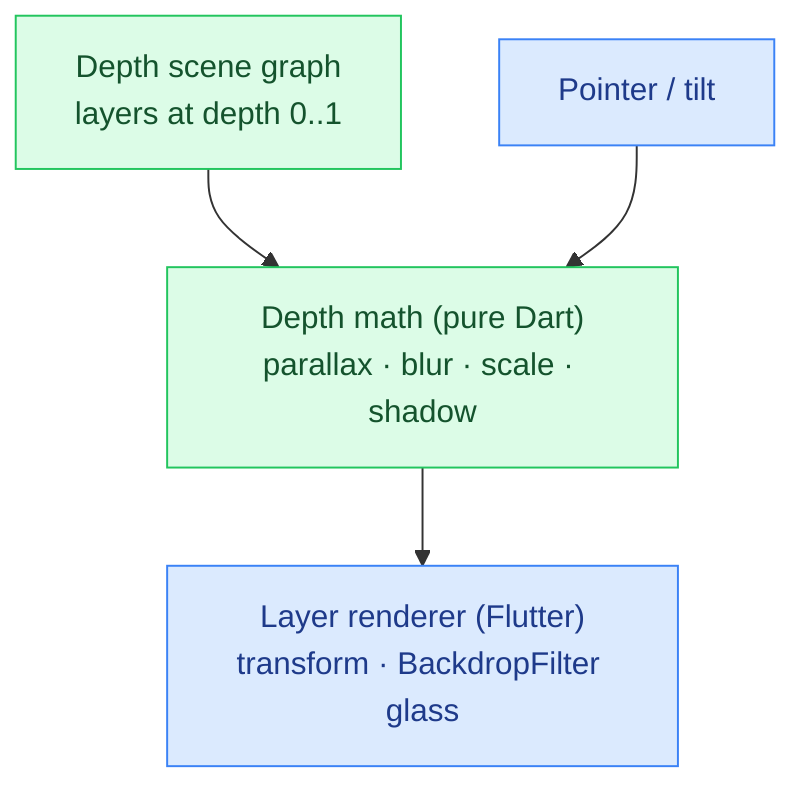

# DepthFlow

**▶ Live demo: https://parag-labs.github.io/depth-flow/** — a Flutter app running on the web
(also runs natively via `flutter run`). Everything is on-device; no backend, no API keys.

A production-quality **spatial depth + soft-glass interface system** for flat screens. Content
lives on multiple depth planes; a pointer (on the web) or device tilt (on a phone) drives
**parallax**, and depth also controls blur, scale, and shadow — so the foreground pops and the
background recedes. Soft glass is used surgically for the nearest surface.

Move your pointer over the demo and the layers shift by different amounts, giving a real sense
of depth with no AR and no performance cost.

---

## Why

Spatial/3D UI and mature glassmorphism are strong trends, but implementations are usually either
heavy AR or cheap, uniform effects. A **performant, non-AR spatial system** where depth actually
drives motion, blur, scale, and shadow is scarce. DepthFlow is a small, reusable one.

## Core idea

The spatial behaviour is pure math in `lib/core/depth.dart`, with no Flutter dependency:

- `parallaxFor(tilt, depth)` — near layers (depth → 1) shift the most; far layers barely move.
  The relationship is slightly non-linear so the foreground pops, and it's clamped to a max.
- `blurFor(depth)` / `scaleFor(depth)` / `shadowFor(depth)` — far layers blur and shrink, near
  layers stay crisp, grow slightly, and cast bigger shadows.
- `tiltFromPointer(x, y, w, h)` — turns pointer/touch position into a normalized tilt in [-1, 1].

Because it's plain math, the whole depth model is unit-tested and reproducible; the Flutter layer
just applies it.

## Architecture



## Demo

```bash
flutter run -d chrome     # web (move the mouse)
flutter run               # a device (tilt / drag)
```

## Design decisions

- **Depth drives everything.** A single `depth` value per layer controls parallax, blur, scale
  and shadow, so the scene stays physically coherent — you can't get a "near" card that's blurry.
- **Glass used surgically.** Only the nearest capture surface uses `BackdropFilter` blur, per the
  design guidance that glass should be an accent, not the whole UI.
- **No AR, 60fps.** Everything is a 2D transform on flat widgets; there's no 3D engine, so it's
  smooth on any device.

## Testing

`flutter test` — 12 tests: parallax ordering (near > far), direction (opposes motion), bounds and
clamping, determinism; blur/scale/shadow monotonicity; and the pointer→tilt mapping.

```bash
flutter test
```

## Roadmap

- Real device-motion (accelerometer) parallax on phones via `sensors_plus`.
- Gesture physics: flick a card and watch it settle with spring damping.
- Spatial memory: cards remember their depth plane between sessions.

## Layout

```
depth-flow/
├── lib/
│   ├── core/depth.dart   # pure Dart: depth model + parallax/blur/scale/shadow math (unit-tested)
│   └── main.dart         # the spatial scene renderer
├── test/                 # 12 flutter_test unit tests
└── web/
```

## License

MIT — see [LICENSE](LICENSE).
